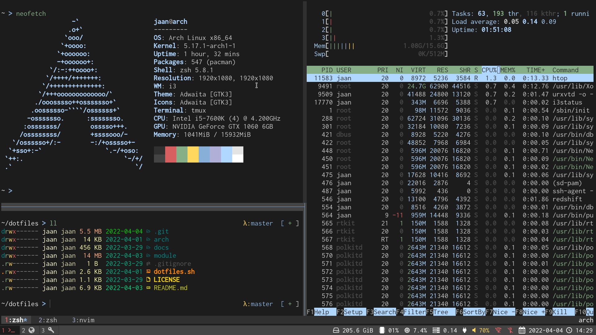

# Dotfiles



## About
This repository contains my files and scripts for installing [Arch Linux](https://archlinux.org/) and configuring various software tools. You are free to copy code, ideas, and structure from the configuration and modify them to your needs. My configuration is a constant work-in-progress, so expect lots of changes over time! I will also list books, code, and other material that has influenced this configuration or improved my Linux skills.

I began the journey to build a custom configuration by reading the book [**Building your Mouseless Development Environment**](https://themouseless.dev/) by [Matthieu Cneude](https://github.com/Phantas0s). So if you are interested in building your configuration, I recommend reading his book first! The contents of this repository will make much more sense afterward.

Furthermore, I recommend reading first the [**Linux Pocket Guide**](https://linuxpocketguide.com/) and then [**Efficient Linux at the Command Line**](https://efficientlinux.com/) by *Daniel J. Barret*. His books give a concise guide to the essential Linux commands and how to use the command line effectively. Knowing these Linux commands and how to use the command line is fundamental for the configuration presented in this repository. 

For a deeper dive into understanding Linux and the Linux kernel, I recommend [**The Linux Programming Interface**](https://man7.org/tlpi/) by *Michael Kerrisk*.


## Philosophy
My configuration philosophy is to strive for a minimal, ergonomic, and composable configuration by avoiding skeuomorphic design and accepting that such configuration requires effort to learn. It builds upon the [Unix Philosophy](https://en.wikipedia.org/wiki/Unix_philosophy). Here are the main principles:

**Keyboard Driven**: We should be able to use our configuration effectively without leaving the keyboard and use the mouse only for graphical tasks.

**Command-line Driven**: We should primarily use programs via Command-Line Interfaces on a command-line shell. Command-Line Clients (CLIs) are a simple, effective, and composable way to interact with programs compared to Graphical User Interfaces (GUIs).

**Prefer Built-in Software Tools, Avoid Unnecessary Dependencies**: We should aim to use the built-in software tools and operating system features and install additional software only if necessary.

**Shell Scripting**: We should create shell scripts for repetitive or complex tasks. We should link the scripts to a single location and make them available throughout the system, similar to built-in commands.

**Search over Navigation**: We should use search whenever possible instead of navigating through menus.

**Text over Binary**: We should use text files over binary. Text files are simple, universal, and searchable, and we can track changes to text files using version control.

**Modular Configuration**: Modularity makes it easier to change components and reason about dependencies.

**Information Security is Essential**: Your data could get lost, be stolen, or hacked unless you protect it with encryption and backups.


## Configuration
Here is an overview of the setup and configurations. 

**System**:

- *UEFI* boot
- *GRUB* bootloader
- *LUKS 1* encrypted root, swap and boot
- *Ext 4* filesystem
- *Terminus-font* for the Linux console.
- [*systemd*](https://systemd.io/) as the system and service manager.

**Shell**:

- *Key Bindings* are similar to VIM.
- [*Xsh*](https://github.com/sgleizes/xsh) conventions for consistent shell configuration.
- *Posix* compliant runcoms for common shell configurations.
- *Bash* for shell scripting.
- *Zsh* as login and interactive shell.
- [*XDG*](https://specifications.freedesktop.org/basedir-spec/basedir-spec-latest.html) specification for defining base and user directories.
- [*Core Utilities*](https://wiki.archlinux.org/title/Core_utilities)
- [*LS_COLORS*](https://github.com/trapd00r/LS_COLORS) for listing files and directories with colors.

**Shell Utilities**:

- [*Git*](https://git-scm.com/) for version control.
- [*GitHub CLI*](https://cli.github.com/) for hosting Git repositories.
- [*OpenSSH*](https://github.com/openssh/openssh-portable) for SSH connections.
- [*rsync*](https://rsync.samba.org/) for file transfer and backups.
- [*fzf*](https://github.com/junegunn/fzf) as the fuzzy finder.
- [*bat*](https://github.com/sharkdp/bat) for viewing files.
- [*fd*](https://github.com/sharkdp/fd) for finding files and directories.
- [*lsd*](https://github.com/Peltoche/lsd) for listing files and directories.
- [*ripgrep*](https://github.com/BurntSushi/ripgrep) for searching text from text files.
- [*ripgrep-all*](https://github.com/phiresky/ripgrep-all) for searching text from multiple files formats.
- [*tldr*](https://tldr.sh/) for simplified help pages.
- [*htop*](https://htop.dev/) for viewing processes interactively.

**Editor**:

- [*Neovim*](https://neovim.io/) as the text editor.
- [*Vim Plug*](https://github.com/junegunn/vim-plug) for managing plugins.
- [*shellcheck*](https://github.com/koalaman/shellcheck) for static analysis for shell scripts.
- *yamllint* for linting Yaml files.

**Window System**:

- [*Inconsolata Nerd Font*](https://www.nerdfonts.com/) 
- [*Xorg*](https://www.x.org/) as the window system.
- [*i3*](https://i3wm.org/) as the tiling window manager.
- [*rxvt-unicode*](https://wiki.archlinux.org/title/rxvt-unicode) as the terminal emulator.
- [*resize-font*](https://github.com/simmel/urxvt-resize-font) plugin for *rxvt*
- [*tmux*](https://github.com/tmux/tmux) as the terminal multiplexer.
- [*Rofi*](https://github.com/davatorium/rofi) as the application launcher.
- [*Dunst*](https://dunst-project.org/) for notifications.
- [*maim*](https://github.com/naelstrof/maim) for taking screenshots.

**Other tools**:

- *Pulse* for managing audio.
- [*brightnessctl*](https://github.com/Hummer12007/brightnessctl) for controlling device backlights.
- [*bluez*](http://www.bluez.org/) for bluetooth.
- [*KeePassXC*](https://keepassxc.org) for managing passwords.
- [*mupdf*](https://mupdf.com/) for viewing PDF and EPUB documents
- [*Zathura*](https://pwmt.org/projects/zathura/)
- [*hledger*](https://hledger.org/) for plain text accounting
- *pandoc*


## Hardware Setup
List of the hardware I am using with my setup.

- *Lenovo Thinkpad T480s* laptop
- [*Kinesis Advantage 2*](https://kinesis-ergo.com/keyboards/advantage2-keyboard/) ergonomic keyboard
- *Razer DeathAdder Elite* ergonomic mouse
- *Kingston DataTraveler* USB flash drive


## Installing Arch Linux
You can read my instructions for creating Archiso and installing Arch Linux.

- [Installing Archiso on USB Drive](./install/archiso.sh)
- [Basic Arch Linux Installation](./install/archlinux_basic.bash)
- [Encrypted Arch Linux Installation](./install/archlinux_encrypted.bash)


## Configuration Management
We can clone the dotfiles repository to the home directory. 

```bash
git clone git@github.com:jaantollander/dotfiles.git $HOME
```

Next, let's change working directory to dotfiles.

```bash
cd $HOME/dotfiles
```

Let's install Yay as a helper for installing packages from the Arch User Repository (AUR).

```bash
./dotfiles.bash install yay
```

Next, install packages for the target module.

```bash
./dotfiles.bash packages "thinkpad_t480s"
```

Finally, install configs for the target module.

```bash
./dotfiles.bash config "thinkpad_t480s"
```


## Documentation
The documentation contains a more detailed configuration overview.

- [Modules](./docs/modules.md)
- [Shell](./docs/shell.md)


## Resources
Here is a list of some helpful resources for developing dotfiles.

- [ArchWiki](https://wiki.archlinux.org/) is the official resource for everything related to Arch Linux.

- *Matthieu Cneude* also has great [articles](https://thevaluable.dev/) on his website and his [dotfiles](https://github.com/Phantas0s/.dotfiles) are also useful. 

- *Maxim Baz* has useful [dotfiles](https://github.com/maximbaz/dotfiles) for Arch Linux.

- An excellent [Bash scripting cheatsheet](https://devhints.io/bash) from *devhints*.

- The [Command Line Interface Guidelines](https://clig.dev/) is an excellent resource for writing command-line interfaces.

- We can use [Argbash](https://argbash.io/) for adding command-line arguments to Bash scripts.

- *Dylanaraps* has written the [pure bash bible](https://github.com/dylanaraps/pure-bash-bible), [pure sh bible](https://github.com/dylanaraps/pure-sh-bible), and [how to write TUI in Bash](https://github.com/dylanaraps/writing-a-tui-in-bash) which are excellent resources for writing better bash and posix shell scripts. He has also written many other interesting projects using shell scripting such as [neofetch](https://github.com/dylanaraps/neofetch), [pfetch](https://github.com/dylanaraps/pfetch), [fff](https://github.com/dylanaraps/fff), [pash](https://github.com/dylanaraps/pash), [torque](https://github.com/dylanaraps/torque), and [shfm](https://github.com/dylanaraps/shfm/)!

- Specification for [Shell and Utilities](https://pubs.opengroup.org/onlinepubs/9699919799/utilities/contents.html).
