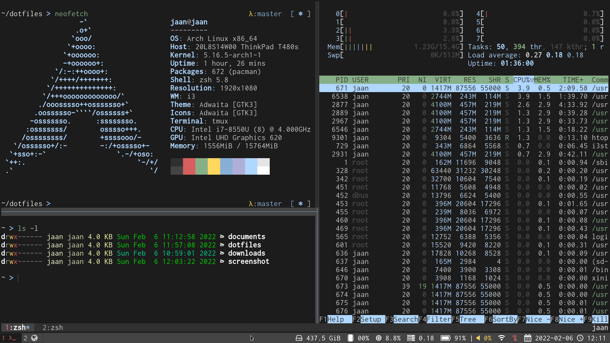

# Dotfiles



## About
This repository contains my scripts and files for installing [Arch Linux](https://archlinux.org/) and configuring various software tools. I began the journey to build a custom configuration by reading the book ["Building your Mouseless Development Environment"](https://themouseless.dev/) by [Matthieu Cneude](https://github.com/Phantas0s). So if you are interested in building your configuration, I recommend reading his book first! The contents of this repository will make much more sense afterward.


## Philosophy
My configuration philosophy is to strive for a minimal, ergonomic, and composable configuration by avoiding skeuomorphic design and accepting that such configuration requires effort to learn. It builds upon the [Unix Philosophy](https://en.wikipedia.org/wiki/Unix_philosophy). Here are the main principles:

- **Keyboard Driven**: We should be able to use our configuration effectively without leaving the keyboard and use the mouse only for graphical tasks.

- **Command-line Driven**: We should primarily use programs via Command-Line Interfaces on a command-line shell. Command-Line Clients (CLIs) are a simple, effective, and composable way to interact with programs compared to Graphical User Interfaces (GUIs).

- **Use Built-in Software Tools and Avoid Unnecessary Dependencies**: We should aim to use the built-in software tools and operating system features and install additional software only if necessary.

- **Shell Scripting**: We should create shell scripts for repetitive or complex tasks. We should link the scripts to a single location and make them available throughout the system, similar to built-in commands.

- **Search over Navigation**: We should use search whenever possible instead of navigating through menus.

- **Text over Binary**: We should use text files over binary. Text files are simple, universal, and searchable, and we can track changes to text files using version control.

- **Modular Configuration**: Modularity makes it easier to change components and reason about dependencies.

- **Information Security is Critical**: Your data could get lost, be stolen, or hacked unless you protect it with encryption and backups.


## Arch Linux Setup
Here is an overview of the setup and configurations. 

System:

- LUKS encrypted UEFI boot and hard-drive.

Key Bindings: 

- VIM like key bindings

Style: 

- Font: *Inconsolata* [*Nerd Font*](https://www.nerdfonts.com/) 
- Theme: Dark, minimalistic theme.

Desktop:

- Window system: [*X11*](https://www.x.org/)
- Tiling window manager: [*i3*](https://i3wm.org/)
- Application launcher: [*Rofi*](https://github.com/davatorium/rofi)
- Notifications: [*Dunst*](https://dunst-project.org/)
- Audio: *PulseAudio*
- Backlights: [*brightnessctl*](https://github.com/Hummer12007/brightnessctl)
- Bluetooth: [*bluez*](http://www.bluez.org/)
- Screenshot: [*maim*](https://github.com/naelstrof/maim)

Terminal:

- Emulator: [*rxvt-unicode*](https://wiki.archlinux.org/title/rxvt-unicode) with [*resize-font*](https://github.com/simmel/urxvt-resize-font) plugin
- Multiplexer: [*tmux*](https://github.com/tmux/tmux)
- Shell: [*Zsh*](https://wiki.archlinux.org/title/zsh)
- Editor: [*Neovim*](https://neovim.io/)

Utilities: 

- [*Core Utilities*](https://wiki.archlinux.org/title/Core_utilities)
- Version Control: [*Git*](https://git-scm.com/)
- File transfer: [*rsync*](https://rsync.samba.org/)
- Search tools: [*ripgrep*](https://github.com/BurntSushi/ripgrep), [*ripgrep-all*](https://github.com/phiresky/ripgrep-all)
- Fuzzy finder: [*fzf*](https://github.com/junegunn/fzf)
- Improved ls: [*lsd*](https://github.com/Peltoche/lsd)
- Improved cat: [*bat*](https://github.com/sharkdp/bat)

Password manager: [*KeePassXC*](https://keepassxc.org)

Document viewer: [*Zathura*](https://pwmt.org/projects/zathura/)

CLIs:

- [*GitHub CLI*](https://cli.github.com/)


## Hardware Setup
List of the hardware I am using with my setup.

- Laptop: *Lenovo Thinkpad T480s*
- Keyboard: [*Kinesis Advantage 2*](https://kinesis-ergo.com/keyboards/advantage2-keyboard/)
- Mouse: *Razer DeathAdder Elite*
- USB Flash Drive: Kingston DataTraveler


## Installation Scripts
### Arch Linux
You can read my instructions for installing Arch Linux in the [**arch**](./arch) directory. It includes instructions with and without encryption and the post-installation steps.

### Configurations 
First, we need to clone the dotfiles repository to the home directory. 

```bash
git clone git@github.com:jaantollander/dotfiles.git $HOME
```

Next, let's define the location of the dotfiles as an environment variable.

```bash
export DOTFILES=$HOME/dotfiles
```

Let's install Yay as a helper for installing packages from the Arch User Repository (AUR).

```bash
bash $DOTFILES/yay/install.sh
```

Next, install all packages.

```bash
bash $DOTFILES/install/packages.sh
```

Finally, install all configs.

```bash
bash $DOTFILES/install/configs.sh
```


## Documentation
The [**documentation**](./docs) contains a more detailed configuration overview.

- [Key bindings](./docs/key-bindings.md)
- [Style](./docs/style.md)
- [System startup](./docs/system-startup.md)
- [Config files](./docs/config-files.md)


## Resources
Here is a list of some helpful resources for developing dotfiles.

- [ArchWiki](https://wiki.archlinux.org/) is the official resource for everything related to Arch Linux.

- *Matthieu Cneude* also has great [articles](https://thevaluable.dev/) on his website and his [dotfiles](https://github.com/Phantas0s/.dotfiles) are also useful. 

- An excellent [Bash scripting cheatsheet](https://devhints.io/bash) from *devhints*.

- [Efficient UEFI Encrypted Root and Swap Arch Linux Installation Procedure with an Encrypted Boot](https://gist.github.com/HardenedArray/ee3041c04165926fca02deca675effe1) by *HardenedArray*

- *Maxim Baz* has [dotfiles](https://github.com/maximbaz/dotfiles) for Arch Linux with Wayland, Kitty, and Kakoune.
